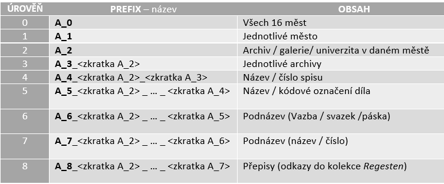

# Analýza zdrojových XML souborů

## Obsah

- Organizace souborů
    - Archiv
        - Přehled
        - Struktura pro plnou větev logického stromu archivu
        - Struktura XML souboru
        - Poznatky
    - Indices
        - Přehled
        - Struktura XML souboru
        - Poznatky
    - Namen
        - Přehled
        - Struktura XML souboru
        - Poznatky
    - Regesten
        - Popis
        - Struktura XML souboru
        - Poznatky
- Shrnutí

# Organizace souborů

Projekt představuje kolekci zdrojových (respektive datových) **XML** souborů organizovaných dle typu do čtyř dílčích složek. Předmětem
analýzy budou XML soubory poskytující indexacia literární záznamy, hierarchii archivu, jména zainteresovaných osob a přepisy listin
dokumentů. Z přepisů dokumentů (*Regesten*) byla vybrána pouze podmnožina: Archive \> Praha \> Archiv Pražského hradu \> Dvorská
komora. Bylo tak učiněno z praktických důvodů. Zbývající kolekce lze považovat za úplné, v původním rozsahu (k datu 1. 10. 2022).

Na pozadí jsou XML soubory transformovány a vysázeny do webového *HTML* pohledu skrze technologii XSLT style-sheetů. Ty jsou odkazované v
hlavičce každého XML. Style-sheety bylo možné nalézt v kořenovém adresáři jakožto soubory s koncovkou *.xsl*. Ve style-sheetech se
využívají doprovodné kaskádové styly (*CSS*), které jsou také součástí kořenové struktury adresáře.

Úlohou bude analyzovat XML soubory dle toho, jakým způsobem jsou plněny a zda jsou plněny konzistentně na úrovnijednotlivých složek
(***Archiv***, ***Indices***, ***Namen*** a ***Regesten***). Je to jednak z toho důvodu, že zdrojové soubory byly plněny a přidávány ručně autorem (p. Manfred Staudinger).

Nalezené nekonzistence a anomálie je nutné zaevidovat a blíže konkretizovat kvůli pozdějšímu plošnému zpracování a transformování
zdrojových souborů do jiného formátu, např. do *JSON*.

Předmětem zájmu bude především struktura zdrojových souborů -- respektive zásadní rozdílnosti ve struktuře mající dopady na
transformaci. Každý XML soubor obsahuje hlavičku, která obsahuje verzi souboru, použité kódování a použitý style-sheet. XML soubor obsahuje také právě jeden kořenový adresář(*root*). Jednotlivá data jsou ohraničena tagy (tzv. elementy). Elementy označují v dokumentu význam jednotlivých částí textu. Uvnitř elementů se používají doplňující parametry. Elementy se nemohou vzájemně překrývat, ale mohou být
vnořeny.

U přepisovaných textů není nezbytně nutné přímo kontrolovat syntax, případně lexikologii. Vhodné je se zaměřit na gramatickou stránku
přepisů/překladů -- tedy na chyby a na korektnost transformace případných [non-ASCII znaků](https://news.ycombinator.com/item?id=9222071) do jiného formátu. Jedná se o dobovou ranou novou horní němčinu (*Frühneuhochdeutsch*, fnhd.). Jazyk se vyznačuje několika non-ASCII znaky. Pro korektní zobrazení je nutné použít vhodné kódování (například tedy [ISO/IEC 8859-15](https://en.wikipedia.org/wiki/ISO/IEC_8859-15) nebo [UTF-8](https://en.wikipedia.org/wiki/UTF-8)).

Následuje rozbor obsahu a struktur dílčích kolekcí:

## Archiv

### Přehled

Obsahuje XML se stromem lokací, ze kterých pochází přepisované textové záznamy. Názvy souborů nesou informaci o jakou lokaci se jedná a o
úrovni zanoření v hierarchii archivu. Archiv je rozdělen na devět úrovní zapouzdření (označené 0 až 8). Struktura úrovní je členěna hierarchicky, a to od nejvyšší úrovně představující archiv s šestnáctiměsty až po tu nejnižší, která obsahuje odkazy přímo na jednotlivé přepisy zaznamenaných textů (odkazy do ***Regesten***).

### Struktura pro plnou větev logického stromu archivu

   

Je důležité podotknout, že obsah na jednotlivých úrovních může být rozdílný než v tabulce. Tabulka představuje jen plné větve stromu lokací, tedy ty, které sahají od 0. až do 8. úrovně zapouzdření. Běžně se může stát, **že větev skoční v jiné než osmé úrovni**. Například větvení děl z Brna je zakončeno na třetí úrovni zapouzdření, kde jsou již odkazy do kolekce ***Regesten***.

### Struktura XML souboru

Struktura jednotlivých XML souborů se mění na každé úrovni zanoření, nicméně princip struktury zůstává stejný, jen s každým dalším zanořením obsahuje více informací (je doplněn o obsah nové úrovně).

> Jako ukázku můžeme zvolit soubor druhé úrovně *A_2\_XXX.xml:*
>
> **\<?xml version=\"1.0\" encoding=\"UTF-8\"?\>**
>
> **\<?xml-stylesheet href=\"../view_archive.xsl\"
> type=\"text/xsl\"?\>**
>
> **\<dr:doc xmlns:dr=\"<http://documenta.rudolphina.org/>\"
> xmlns=\"<http://www.w3.org/1999/xhtml>\" uri=\"A_2\_Nazev archivu\"
> v=\"PUBLICATION-DATE"\>**
>
> **\<title\>Nazev archivu\</title\>**
>
> **// Cesta k tomuto souboru obsahující odkazy na předchozí úrovně**
>
> **\
**
>
> **\<a href=\"../Archiv/A_0\_Archive.xml\"\>Archive \</a\> &gt;**
>
> **\<a href=\"../Archiv/A_1\_Archive_Nazev mesta.xml\"\>Nazev
> mesta\</a\> &gt; \<span\>\<Nazev archivu\>**
>
> **\</div\>**
>
> **// Cesta s odkazy k souborům na nižší úrovni**
>
> **\<ul\>**
>
> **\<a href=\"../Archiv/A_3\_Zkratka mesta_Nazev archivu.xml\"\>Nazev
> archivu \</a\>**
>
> **...**
>
> **\<a href=\"../Archiv/A_3\_Zkratka mesta_Nazev archivu.xml\"\>Nazev
> archivu \</a\>**
>
> **\</ul\>**
>
> **\</dr:doc\>**

### Poznatky

Nultou úroveň zanoření představuje výchozí soubor *A_0\_Archive.xml*, ve kterém se nachází šestnáct měst (Bologna, Brno, Brussel, Firenze, Frankfurt a.M., Leiden, Linz, Los Angeles, München, Nürnberg, Praha, Pulkowo/St. Petersburg, Ramsen, St. Pölten, Vaduz, Wien), které představují úrovně nižšího zanoření. Názvy měst nejsou v jednom jazyce, ale liší se podle toho, v jakém státě se město nachází (Česká města jsou česky -- Praha, Brno; Německá jsou německy -- München, Nürnberg a podobně). Organizace archivu kvůli tomu nemusí být vždy přehledná a překlad do jednoho výchozího jazyku (např. angličtiny) by mohl navigaci archivem pro uživatele zjednodušit.

Struktura je logicky členěná, nicméně jelikož obsahuje devět úrovní, musí se pro názvy úrovní a tím pádem i pro jednotlivé XML souboru
používat zkratek. Dochází tedy k tomu, že v čím nižší vrstvě jsme, tím nepřehlednější a méně srozumitelné se názvy a zkratky mohou zdát.
Například u souboru druhé úrovně *A_1\_Archive_Wien.xml* jasně vyplívá, že se jedná o soubor města Vídeň. Avšak z *A_8\_OStA_HHStA_RHR_GetF_GewFabPriv_Karton_3\_4_Faszikel_3\_Konvolut_4,* tedy souboru osmé úrovně zanoření, jen těžko na první pohled poznáme význam a obsah tohoto souboru. Jelikož je členění hierarchické, restrukturalizace by se nemusela jevit jako vhodná (těžko bychom
vymysleli lepší způsob členění), nicméně změna zkratek v názvu souborů na logičtější -- více přehledné by mohla být přínosem a řešením případné nepřehlednosti.

-   Konkrétní větev logického stromu končí přesměrováním (odkazem) na konkrétní přepis záznamu. Není to vždy pravidlem, dochází k
    případům, že úroveň zanoření už obsahuje konečný odkaz do kolekce **Regesten**, avšak hierarchie se může dále větvit do nižších
    úrovní, které také mohou obsahovat odkazy do kolekce **Regesten**.

-   V hlavičce je obsažen parametr představující verzi (datum vytvoření). Při načtení stránky dochází na pozadí (skrze style-sheet
    ***view_archive.xsl***) k zobrazení dvou řetězců (jeden představuje **copyright s autorem**, **druhý verzi**). Textový řetězec s verzí slouží jako odkaz, který odkazuje na příslušnou verzi projektu (v tento moment existuje pouze jedna verze, avšak při pozdější editaci toto může sloužit jako vhodný nástroj pro sledování prováděných změn).

-   Jelikož se jedná v podstatě o seznam s odkazy do vnitřního zapouzdření, je struktura jasná a ve většině kontrolovaných souborů
    neměnná. **Zápis** se tedy jeví být **konzistentním**.

## Indices

### Přehled

Obsahuje HTML soubory s abecedními seznamy osob. Kategorizováno dle počátečního písmene příjmení. Obsahem jsou reference do kolekce *Namen* na korespondující jména autorů. Po rozkliknutí detailu osoby se zobrazí seznam přepsaných záznamů (respektive odkazy do kolekce *Regesten*), ve kterých je daná osoba evidována. Platí, že ze jména osoby je možné přímo přejít až na konkrétní přepsané záznamy, v nichž osoba figuruje. Platnost je oboustranná -- z přepisu záznamu je možné [přejít](#regesten) na detail osoby v něm figurující.

Dále jsou zde přítomny XML (a příslušné XSLT) s nekorespondujícími informacemi. První se týká informací o samotném projektu Documentaria
Rudolphina (*Ind_Spec.xml*). Druhý pak zahrnuje chybový výpis, který je zobrazen v momentě, kdy použitý webový prohlížeč nepodporujestyle-sheety (*system_property.xml*). Pro interpretaci stránek je zde vyhrazena logika Javascriptu (***hbrowser_e.js***). Má vliv na uživatelskou zkušenost v různých webových prohlížečích.

Za účely rozboru budou použity zdrojové XML obsahující bibliografické seznamy literárních děl příslušného autora. Na jeden zdrojový soubor připadá jeden autor. Autorovi může být vyhrazeno více souborů -- např. z různých let. Názvy souborů nesou prefix „Lit\_", jméno autora a případně i rok vydánídíla.

### Struktura XML souboru

> **\<?xml version=\"1.0\" encoding=\"UTF-8\"?\>**
>
> **\<?xml-stylesheet href=\"../view_literatur.xsl\"
> type=\"text/xsl\"?\>**
>
> **\<body xmlns=\"<http://www.w3.org/1999/xhtml>\" uri=\"Jmeno autora,
> pripadne i rok\"\>**
>
> **// Text obsahující seznam literárních děl příslušného autora a
> informace o těchto dílech**
>
> **// Stylizovaný odkaz**
>
> **\</body\>**

### Poznatky

Struktura je konzistentní pro všechny kontrolované soubory obsahující bibliografické seznamy literárních děl příslušného autora. Hlavička je standardní u všech literárních záznamů. Pořadí elementů (až na výjimky, viz níže) je konzistentní, pro ohraničení údajů se používají v každém souboru identické tagy. Elementy se nepřekrývají. Pro vysázení do *HTML* je použit XSLT style-sheet (*view_literatur.xsl*). Obsahová část je uvozena elementem \<*body*\>. Řetězec URI kopíruje strukturu názvu souboru. Je tvořen dvojicí jméno autora a rok publikování díla.

Obsah těla XML souboru se vždy liší a mezi jednotlivými soubory nepřevládá žádná konvence. Vždy je zde uvedeno celé jméno autora
(popřípadě i spoluautorů) a název díla. Je-li k dispozici i archiv umístění díla, je zde taktéž uveden. Všechny textové popisy díla
obsahují i rok vydání díla a některé i místo vydání. Tělo také může obsahovat informaci o čísle stránek či jednotlivých svazků. Jelikož se jedná o textový řetězec a jeho struktura není pro všechny soubory stejná, je do něj možné doplnit prakticky jakoukoliv informaci o dílu. Neobsahuje dlouhé úseky souvislého textu, gramatika nebyla detailně kontrolována.

-   Seznam děl je nutné zachovat. Jedná se o textové řetězce není nutné provádět specifickou transformaci. Seznam děl **se** v souborech
    **vyskytuje vždy**, **zápis** textu je **konzistentní**.

-   Informace o díle jsou ve zdrojových souborech odřádkovány, nejsou však vždy uvozeny tagem (*\<br/\>*). **Zápis konzistentní, výskyt
    nepravidelný**.

-   Veškerý obsah informací se vyskytuje ve zdrojových souborech jako prostý text v jednom elementu. Je vždy uvozen tagem *\<body\>*. **Zápis konzistentní, výskyt pravidelný**.

-   Soubory mohou obsahovat vložené odkazy. Například soubor „Lit\_ Vignau-Wilberg_1992.xml" obsahuje dokonce stylizovaný hypertextový
    odkaz. Odkaz vede na dané literární dílo na Google Books ([https://books.google.com/](https://books.google.com/)).
    Je nepravděpodobné, že se jedná o jediné dílo, pro které existuje jeho online verze. Jelikož se jedná o manuálně vytvořené a naplněné
    zdrojové soubory jedním autorem, je možné, že se rozhodl jen do nějakých vložit odkaz na e-verzi díla. **Zápis je nekonzistentní**.
    Textový obsah s informacemi o dílech je **pravidelný**, avšak odkaz na online verzi díla je **nepravidelný**.

-   Doprovodné webové odkazy do digitálních archivů, či na digitální verzi publikace je **vhodné ponechat**, avšak v jednotné podobě a
    vždy na stejné pozici v textu (např. za textem knižního záznamu). **Nutno transformovat** pro zajištění konzistence. **Výskyt
    nepravidelný**.

-   Na soubory se seznamy citujících děl je možné se přesměrovat pouze z detailu přepisovaného záznamu v kolekci *Regesten*. Přehled všech souborů s literaturou není k dispozici v ucelené podobě. **Vazby je nutné zachovat**. Vytvoření přehledu není nezbytně nutné.

## Namen

### Přehled

Zahrnuje XML soubory s informacemi o jedné konkrétní historické osobě. U osob je evidováno jméno, případně titul. U západních jmen je použita interpretace v pořadí „příjmení", „jméno". Následuje přirozený zápis celého jména včetně přízvisek a titulů. Dále zde mohou být uvedena místa a data narození, případně úmrtí a další jména, pod kterými je možné osobu identifikovat. V některých záznamech je možné najít i jména blízkých příbuzných v doprovodu dalších detailů, tak i výpis povolání. Dále jsou zde explicitně uvedeny reference na všechny textové záznamy, ve kterých osoba figuruje. Odkazováno je do kolekce *Regesten*. Jsou-li pro osobu evidována tištěná díla (*Gedruckte Werke*), následuje jejich výčet. Pro (budoucí) vyhledávání v rámci archivu byly pro každou osobu stanoveny význačné indexy.

### Struktura XML souboru

> **\<?xml version=\"1.0\" encoding=\"UTF-8\"?\>**
>
> **\<?xml-stylesheet href=\"../view_names.xsl\" type=\"text/xsl\"?\>**
>
> **\<dr:doc
> xmlns=[http://www.w3.org/1999/xhtml](http://www.w3.org/1999/xhtml)
> xmlns:dr=\"<http://documenta.rudolphina.org/>\" v=\"
> PUBLICATION-DATE\"\>**
>
> **\<title\>Prijmeni, Jmeno\</title\>**
>
> **\<h3\>Jmeno Prijmeni \</h3\>**
>
> **// Datum narození, úmrtí, informace o příbuzných, alternativní
> jména, povolání apod.**
>
> **\
\<b\>Quellen:\</b\>\<a
> href=\"../Regesten/XXX.xml\" title=\"XXX\"\>XXXX- XX-XX\</a\> ...
> \</div\>**
>
> **// Seznam děl**
>
> **\<ul\> ... \</ul\>**
>
> **\<dr:ix\> IndexA XX XXX XXXX \</dr:ix\>**
>
> **\</dr:doc\>**

### Poznatky

Pořadí elementů (až na výjimky, viz níže) je konzistentní, pro ohraničení údajů se používají v každém souboru identické tagy. Elementy se nepřekrývají. Hlavička dokumentu je shodná u všech zdrojů.

Uchovává se informace o poslední verzi (datum). Zápis referencí a indexů pro vyhledávání je konzistentní. Rozdíly je možné pozorovat u detailu dané osoby. Datum a místo narození, respektive úmrtí, nejsou ve všech záznamech dostupná. Stejný případ platí i u jmen příbuzných, povolání a seznamu tištěných děl -- jedná se o dodatečné údaje, které ani nemusí být kompletní (ať už např. z hlediska datumu, či lokace). Při zpracování je nutné brát v potaz možnost výskytu všech dodatečných údajů. Soubory neobsahují dlouhé úseky souvislého textu, gramatika nebyla detailně kontrolována.

- Životní data osoby a případně dodatečné identifikátory nejsou v souboru opatřeny tagy (tím pádem ani odřádkovány). Jsou chápany jako jeden dílčí řetězec. **Zápis** se jeví být **konzistentní**, **výskyt nepravidelný**.

- Ke zobrazení copyrightu dochází pomocí style-sheetu. Výpis informace o verzi funguje stejně jako u kolekce **Archives**.

- Informace (respektive řetězec) o příbuzných dotyčné osoby je vždy odřádkována(*\<br/\>*). **Zápis konzistentní**, **výskyt nepravidelný**.

- U výpisu povolání nastala situace, že v některých případech nejsou odřádkována. Nebylo prokázáno, že by se tento jev týkal pouze neúplných záznamů (tj. bez dat zahájení/zanechání zaměstnání). V dalších případech jsou uvozena tagem *\<br/\>* značící odřádkování -- **zápis je nekonzistentní**. **Výskyt nepravidelný**.

- Seznam děl se vkládá mezi reference do záznamů a vyhledávací indexy. Jedná se o neseřazený seznam prostých textů. **Zápis konzistentní, výskyt nepravidelný**.

- V osobě jsou uvedeny hypertextové odkazy na všechny přepisy, ve kterých je zmiňována.

## Regesten

### Popis

Obsahuje XML soubory s jednotlivými přepisy zaznamenaných textů. Název souboru je sestaven z prefixu „A" (pro archiv), datumu (z něhož původní text pochází) a z pěticiferného číselného indexu. Název souboru je shodný s jeho URI. Z jednoho dne může pocházet více záznamů. K rozboru byla vybrána pouze podmnožina (Archive - Praha - Archiv Pražského hradu - Dvorská komora). Po standardní hlavičce následuje název záznamu, případně i datum a místo, kde byl pořízen. V jistých případech je zde možné najít *metadata* uvozující v textu se vyskytující osoby. Pak jsou uvedeny reference na „zainteresované" osoby, kterých se text týká (konkrétní tvar referovaného jména v textu lze odečíst z funkce onmouseover= "highlightWords()"). Následuje přepis původního textu. V textu může být umístěn neseřazený seznam položek. Pod textovým segmentem jsou umístěny metadata o archivu, z něhož zápis pochází a následují reference na jednotlivé hierarchické stupně archivu. Výpis archivního zanoření je zakončen číslem záznamu/spisu. Může následovat informace o dřívější katalogizaci, v podobě zdrojového archivu a čísla svazku. Autor v některých záznamech uvádí i seznam pozdějších děl, citující zde překládaný originál.

### Struktura XML souboru

> **\<?xml version=\"1.0\" encoding=\"UTF-8\"?\>**
>
> **\<?xml-stylesheet href=\"../view_regest.xsl\" type=\"text/xsl\"?\>**
>
> **\<dr:doc xmlns=\"<http://www.w3.org/1999/xhtml>\"
> xmlns:dr=\"<http://documenta.rudolphina.org/>\" v=\"
> PUBLICATION-DATE\" uri=\"A1616-02-05- 02723\" a=\"MSt\"\>**
>
> **\<title\>TITLE\</title\>**
>
> **// Metadata o referovaných osobách/jevech (.pi/.si/.pa apod.)
> TITLE**
>
> **DATE, LOCATION**
>
> **\
**
>
> **//Odkazy na osoby**
>
> **\</div\>**
>
> **\
**
>
> **// Vlastní text přepisu**
>
> **// Neseřazený seznam**
>
> **\<ul\> ... \</ul\>**
>
> **\</div\>**
>
> **// Metadata zdrojového archivu (.i1)**
>
> **\
**
>
> **//Reference do archivnich stupnu + cislo prepisu, svazku apod.**
>
> **\</div\>**
>
> **// Dřívější katalogizace**
>
> **// Seznam děl, citující zde uvedený přepis**
>
> **Copyright © XXXX Manfred Staudinger**
>
> **\</dr:doc\>**

### Poznatky

Pořadí elementů v souborech (v rámci podmnožiny) je konzistentní. Údaje jsou ohraničeny totožnými tagy. Elementy se nepřekrývají. Hlavička dokumentu je shodná u všech zdrojů. Pro vysázení do *HTML* je použit identický XSLT (*view_regest.xsl*) v doprovodu *CSS*. Všechny zkoumané soubory v sobě zahrnovaly referenční seznam osob, překlad vlastní textové části a hierarchii archivu (včetně zanoření). Rozdíly bylo možné pozorovat především v překládaných textech ze stylizačních důvodů.

Soubory se také lišily rozdílným množstvím metadat a přítomností informací o dřívější katalogizaci a výskytu v pozdějších dílech. Při zpracování je nutné brát v potaz možnost výskytu všech výše uvedených údajů.

- Vysázení textu přepisu se řídí dle style-sheetu *view_regest*. Ten se může odkázat na příslušné kaskádové styly. V textu se vyjma přepisovaných dobových textů nacházejí i **vysvětlivky** (např. *fol. v*, *fol. r*, *Betreff:*, *Datum:*, *Ablage:*, *Resolution:*, *Vermerk:*, *Gezeichnet:* apod.). Zvýraznění se uskutečňuje opět skrze style-sheet. Společným znakem je umístění v hranatých závorkách.

- Jedná se o dlouhé souvislé texty. Po gramatické stránce jsou evidovány chybějící písmena v přepisovaných slovech. Autor zdůrazňuje tuto skutečnost uvedením hranatých závorek. Ty mohou, ale nemusí, domnělé znaky obsahovat. Autentičnost záznamu však může být narušena. Dalším častým jevem je archaický zápis zaměňující samohlásku „u" se souhláskou „v". Tento jev však není plošný. Zaznamenány byly i překlepy, které pravděpodobně byly způsobeny manuálním přepisem. **Texty je vhodné v této podobě zachovat, včetně stylisticky odlišných značek**. Korektura by měla být provedena dostatečně kvalifikovanými subjekty.

- Součástí zdrojového souboru, podobně jako u kolekce Archive, je informace o verzi a copyrightu. Verzování funguje stejně jako u kolekce Archive, po odkaz zobrazí **návrh citace přepisu**. Copyright je zde uveden přímo v XML souboru jako textový řetězec.

- Metadata o odpovídajícím archivu byla přítomna ve všech zdrojových souborech, metadata týkající se jmen vždy korelovala s referovaným seznamem. V jednom případě se autor v metadatech odkazuje na záznam netýkající se osoby (např.: *Mammalia: Panthera leo*), není však v uvedeném referenčním seznamu uveden, jelikož se příslušný záznam v archivu (pravděpodobně) nenachází. Metadata vždy byla uvozena znakem pro instrukci zpracování jako např.: .*pi*, .*si*, .*pa*, *.\**, .*cs*. Takto uvedené řetězce nejsou ve webovém pohledu vysázeny. V případě jmen osob, či názvů archivů se navíc jedná o duplicitní (již zavedenou) informaci. Výskyt je nepravidelný, metadata je **vhodné zachovat**, **na výstupu nezobrazovat**.

- Informace o katalogizaci (zdrojový archiv a číslo svazku) je uvozena instrukcí *.i1*. Na výstupu se nezobrazuje, identická informace je uvedena za hierarchií archivů a v záhlaví přepisu. **Vhodné zachovat**, **na výstupu nezobrazovat**.

- Je-li uvedeno, že přepisovaný záznam byl doložen v jiných dílech (uvozeno spojením: „*Zitiert in*", „*Zitiert nach*", případně „*Literatur*"), je vypsán seznam citující literatury. Zajímavým poznatkem je, že pod jménem autora a rokem publikace je schován odkaz do kolekce ***Indices*** na příslušný seznam bibliografie. Element představující link do kolekce zde však není explicitně uveden (na rozdíl například od referencí na osoby). Tato závislost nesmí být při transformaci opomenuta a funkcionalita musí být zachována. K přiřazení odkazu dochází na **pozadí** -- opět skrze XSL sheet ***view_regest***. V XML se jedná o běžný textový řetězec. **Výskyt jevu je nepravidelný**, **nutné doplnit a zohlednit**.

- Přepis si drží informace (odkazy) o osobách, které zmiňuje.

## Shrnutí

Jelikož při této analýze docházelo ke zkoumání jen omezeného množství souborů, lze usuzovat, že kvůli tomu, že soubory vznikaly manuálně, tak s velkou pravděpodobností existuje množství nesrovnalostí, chyb a odchylek, které se mohou při práci s více soubory objevit.

Během analýzy se uskutečnilo i porovnání zobrazení dokumentů v několika webových prohlížečích (Google Chrome, Mozilla Firefox, Safari a Microsoft Edge) při aktuálních verzích. Během tomto zkoumání byla zjištěna nesrovnalost se zobrazováním verze souboru v kolekci *Regesten*. Celkové chování v prohlížeči Mozilla bylo odlišné od ostatních prohlížečů (na funkcionalitě to však nic zásadně neměnilo) -- docházelo například k přesměrování na novou stránku namísto zobrazení rozbalovacího (*drop-down*) seznamu.

Domníváme se, že data uložená v samostatných XML souborech a stylování pomocí XSLT neodpovídají kvalitě a standardu soudobých moderních webů. Absence souborového systému (typu databáze) zhoršuje přehlednost a přidávání nových stránek znamená vytváření nových XML souborů a propojení skrze kolekce.