## KIV/INS

# Analýza webových stránek Documentaria Rudoplhina

#### Viktorie Pavlíčková

#### Josef Bozděch

#### Tomáš Zikmund

#### František Kaiser

#### Jan Černogurský

#### Štěpánka Krutinová

#### 20. ledna 2023

(Na pokračování projektu pracovali: Petr Urban, Miroslav Vdoviak, Jakub Schenk, Jaromír Lahečka, Lukáš Hauzner, Martin Jakubašek, Petr Štěpánek, Václav Hrabík - 11. listopadu 2023)

## Obsah


- 1 Zadání
- 2 Analýza
   - 2.1 Dotazy a odpovědi
         - (Pouze odkaz do hlavní aplikace?) 2.1.1 Co je myšleno autoritami? Kde jde získat, jak je najít?
         - html (v XML)? 2.1.2 Existují někde raw data, tj. nejsou už přeložená do
      - 2.1.3 Udržovala se informace o tom, kdo prováděl úpravy?
         - z každé konkrétní stránky, nebo seznam lze nalézt i jinde? 2.1.4 Je nutné získat seznam literatury extrahováním odkazu
         - struktury? Podle zanoření, nebo celý projekt? 2.1.5 Jakým způsobem vyhledávat full text uvnitř adresářové
   - 2.2 Struktura
      - 2.2.1 ./Archiv/
      - 2.2.2 ./Indices/
      - 2.2.3 ./Namen/
      - 2.2.4 ./Regesten/
      - 2.2.5 Datová struktura
- 3 Analýza zdrojových XML souborů
   - 3.1 Organizace souborů
      - 3.1.1 Archiv
      - 3.1.2 Indices
      - 3.1.3 Namen
      - 3.1.4 Regesten
   - 3.2 Výstup analýzy
- 4 Databáze autorit a propojení
- 5 Návrh řešení
   - 5.1 Zachování stávajících struktur
   - 5.2 Vytvoření nového systému
   - 5.3 UI návrh
      - 5.3.1 Dokumente
      - 5.3.2 Detail dokumentu
      - 5.3.3 Vyhledávání
      - 5.3.4 Databáze
      - 5.3.5 Server
      - 5.3.6 Frontend
- 6 Transformace XML do JSON
   - 6.1 Person
   - 6.2 Artwork
   - 6.3 Dotazování
- 7 Závěr


# Zadání

Cílem je vytvořit návrh aplikace archivu, který bude schopen
fulltextového vyhledávání, vyhledávání na základě konkretní kategorie
záznamu (například lokality uložení archiválie, jména, času apod.) Každý
archivní dokument musí mít unikátní URL (z důvodu citací, stávající URL
na dokument je třeba zachovat funkční tak, aby starší odkazy
v literatuře byly dostupné). Procházení archivu ve stávající struktuře.
Umožnit trasovatelnou editaci dat aby bylo zřejmé kdo data
upravil/pořídil. Propojení s databází autorit (i s vice než jednou a
umožnit prioritizaci a standardizaci výsledku). Zobrazit seznam
literatury. Frontend by mel využívat SemanticUI nebo FormaticUI tak, aby
byl vizuálně podobný s Inventaria Rudolphina. Ostatní technologie jsou
ke zvážení.

# Analýza

## Dotazy a odpovědi

### Co je myšleno autoritami? Kde jde získat, jak je najít? (Pouze odkaz do hlavní aplikace?)

Vazby k databázi autorit budou tvořeny manuálně nebo alespoň manuálně
potvrzovány. Vzhledem k tomu, že předpokládáme, že Documenta budou mít
editor, tak vyhledání a následné manuální potvrzení by mělo být
nejlepším řešením. Prioritizace je důležitá v okamžiku více zdrojů.
Priorita může být *hard coded* jako jednoduché pořadí zdrojů. Databáze
se mohou (a budou) překrývat. Proto je třeba definovat, kterému zdroji
věříme více. Data z autorit by měla být uložena lokálně podobně jako je
tomu v Inventaria, protože se nad nimi bude snáze vyhledávat.
Synchronizace může probíhat jednou za x dní (měsíc?), data se mění velmi
málo.

### Existují někde *raw* data, tj. nejsou už přeložená do html (v XML)?

Pod raw daty se rozumí již ta ve formátu XML.

### Udržovala se informace o tom, kdo prováděl úpravy?

Editace dokumentů v tuto chvíli v Documenta není trasovatelná. Nebyl
k tomu důvod - vše přepisoval a na web umísťoval jeden člověk. Bohužel
pokud bude data pořizovat a přidávat více lidí, potřebujeme vědět, kdo
to byl.

### Je nutné získat seznam literatury extrahováním odkazu z každé konkrétní stránky, nebo seznam lze nalézt i jinde?

Během práce na Inventaria jsme zjistili, ze Getty ULAN nepokrývá všechna
jména (pochopitelně) a začali jsme uvažovat o použití další databáze
autorit. Ideálně by mělo jít o rozšiřitelný systém který by měl datový
model podobný tomu co získáváme z ULAN (což můžete vidět v Inventaria) a
ten by se pak plnil z dalších zdrojů. Je zřejmé, že ne všechny zdroje
budou schopny plnit všechna data. Zatím uvažujeme o Bibliografii dějin
Českých zemí, nicméně nemáme od nich jasnou odpověď, zdali je dostupná
přes API. Dalším zdrojem by měl být statický soubor (csv/json), který by
bylo možné nahrát a v němž by byla další jména. Nemyslíme, že by to
potřebovalo UI protože soubor bude obsahovat odhadem desítky jmen.
Ukázka dat jednoho z nalezených záznamů viz: `BxlA-6.json`. Je zde
zachycena struktura Getty ULAN záznamu (klíč getty_data).

### Jakým způsobem vyhledávat full text uvnitř adresářové struktury? Podle zanoření, nebo celý projekt?

Vyhledávač by měl umět pracovat nad strukturovanými daty jako
v Inventaria. I když tam vidíte značné zjednodušení. Vyhledávač
neumožňuje formulovat libovolný dotaz do db. Full text v Inventaria
funguje hodně primitivně. Využívá full text schopnosti v MongoDB. Nic
více. A pracuje v režimu AND. Domnívám se, že pro první verzi podobné
chování bude víc než dostatečné. Pokud navrhnete vylepšený přístup, tak
se samozřejmě nebráníme.

## Struktura

V projektu jsou adresáře:

### ./Archiv/ 

Obsahuje XML se stromem lokací, ze kterých pochází texty. Názvy souborů
nesou informaci o úrovni zanoření hierarchie. Ponecháno v původním
rozsahu.

### ./Indices/

Obsahuje HTML soubory se seznamy osob dle počátečního písmene příjmení
(?). Dále tu jsou XML s něčím, co vypadá jak citační záznamy pro lit.
prameny. Ponecháno v původním rozsahu.

### ./Namen/

XML soubory s informacemi o jedné osobě. Občas jsou zde uvedené jména
příbuzných. Dále tu jsou odkazy na texty, kde osoba figuruje. Ponecháno
v původním rozsahu.

### ./Regesten/

XML soubory s jednotlivými přepisy textů. Vybrána jen podmnožina
z Archive - Praha - Archiv Pražského hradu - Dvorská komora. V \"horní\"
části souboru bývá seznam jmen, kterých se text týká. Konkrétní tvary
jmen v textu lze odečíst z onmouseover=\"highlightWords()\" funkcí.

### Datová struktura

Na pozadí jsou XML soubory, které jsou transformované/vysázené do html
skrze technologii XSLT style sheetů. Ty jsou odkazované v headeru
každého XML. Stylesheety lze nalézt v root jako soubory s koncovkou
.xsl. Více informací
[zde](https://www.w3schools.com/xml/xsl_transformation.asp)

# Analýza zdrojových XML souborů

## Organizace souborů

##### 

Projekt představuje kolekci zdrojových (respektive datových) XML souborů
organizovaných dle typu do čtyř dílčích složek. Předmětem analýzy budou
**XML** soubory poskytující indexaci a literární záznamy, hierarchii
archivu, jména zainteresovaných osob a přepisy listin dokumentů.
Z přepisů dokumentů (*Regesten*) byla vybrána pouze podmnožina:
Archive - Praha - Archiv Pražského hradu - Dvorská komora. Bylo tak
učiněno z praktických důvodů. Zbývající kolekce lze považovat za úplné,
v původním rozsahu (k datu 1. 10. 2022).\
\
Na pozadí jsou XML soubory transformovány a vysázeny do webového *HTML*
pohledu skrze technologii XSLT style-sheetů. Ty jsou odkazované
v hlavičce každého XML. Style-sheety bylo možné nalézt v kořenovém
adresáři jakožto soubory s koncovkou *.xsl*. Ve style-sheetech se
využívají doprovodné kaskádové styly (*CSS*), které jsou také součástí
kořenové struktury adresáře.\
\
Úlohou bude analyzovat XML soubory dle toho, jakým způsobem jsou plněny
a zda jsou plněny konzistentně na úrovni jednotlivých složek (***Archiv,
Indices, Namen a Regesten***). Je to jednak z toho důvodu, že zdrojové
soubory byly plněny a přidávány ručně autorem (p. Manfred Staudinger).
Nalezené nekonzistence a anomálie je nutné zaevidovat a blíže
konkretizovat kvůli pozdějšímu plošnému zpracování a transformování
zdrojových souborů do jiného formátu, např. do *JSON*.\
\
Předmětem zájmu bude především struktura zdrojových souborů --
respektive zásadní rozdílnosti ve struktuře mající dopady na
transformaci. Každý XML soubor obsahuje hlavičku, která obsahuje verzi
souboru, použité kódování a použitý style-sheet. XML soubor obsahuje
také právě jeden kořenový adresář (*root*). Jednotlivá data jsou
ohraničena tagy (tzv. elementy). Elementy označují v dokumentu význam
jednotlivých částí textu. Uvnitř elementů se používají doplňující
parametry. Elementy se nemohou vzájemně překrývat, ale mohou být
vnořeny.\
\
U přepisovaných textů není nezbytně nutné přímo kontrolovat syntax,
případně lexikologii. Vhodné je se zaměřit na gramatickou stránku
přepisů/překladů -- tedy na chyby a na korektnost transformace
případných non-ASCII znaků do jiného formátu. Jedná se o dobovou ranou
novou horní němčinu (*Frühneuhochdeutsch*, fnhd.). Jazyk se vyznačuje
několika [non-ASCII
znaky](https://news.ycombinator.com/item?id=9222071). Pro korektní
zobrazení je nutné použít vhodné kódování (například tedy [ISO/IEC
8859-15](https://en.wikipedia.org/wiki/ISO/IEC_8859-15), nebo
[UTF-8](https://en.wikipedia.org/wiki/UTF-8)).\
\
Následuje rozbor obsahu a struktur dílčích kolekcí:

### Archiv

#### Přehled

##### 

Obsahuje XML se stromem lokací, ze kterých pochází přepisované textové
záznamy. Názvy souborů nesou informaci o jakou lokaci se jedná a
o úrovni zanoření v hierarchii archivu. Archiv je rozdělen na devět
úrovní zapouzdření (označené 0 až 8). Struktura úrovní je členěna
hierarchicky, a to od nejvyšší úrovně představující archiv s šestnácti
městy až po tu nejnižší, která obsahuje odkazy přímo na jednotlivé
přepisy zaznamenaných textů (odkazy do ***Regesten***).

#### Struktura pro plnou větev logického stromu archivu

<div align="center">
  <a href="https://gitlab.com/josef.bozdech2/tgi_sp/-/blob/develop-2023">
    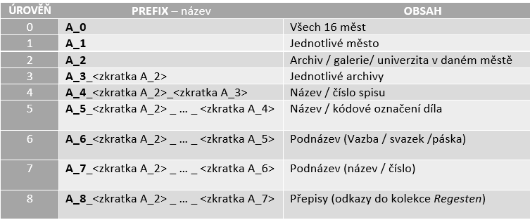
  </a><br/>

</div>


Je důležité podotknout, že obsah na jednotlivých úrovních může být
rozdílný než v tabulce. Tabulka představuje jen plné větve stromu
lokací, tedy ty, které sahají od 0. až do 8. úrovně zapouzdření. Běžně
se může stát, **že větev skoční v jiné než osmé úrovni**. Například
větvení děl z Brna je zakončeno na třetí úrovni zapouzdření, kde jsou
již odkazy do kolekce ***Regesten***.

#### Struktura XML souboru

##### 

Struktura jednotlivých XML souborů se mění na každé úrovni zanoření,
nicméně princip struktury zůstává stejný, jen s každým dalším zanořením
obsahuje více informací (je doplněn o obsah nové úrovně).\
\
Jako ukázku můžeme zvolit soubor druhé úrovně *A_2\_XXX.xml*:

<div align="center">
  <a href="https://gitlab.com/josef.bozdech2/tgi_sp/-/blob/develop-2023">
    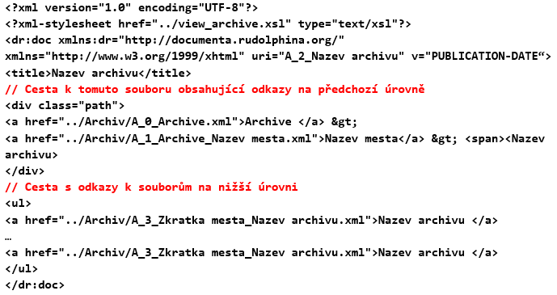
  </a><br/>

</div>


#### Poznatky

##### 

Nultou úroveň zanoření představuje výchozí soubor *A_0\_Archive.xml*, ve
kterém se nachází šestnáct měst (Bologna, Brno, Brussel, Firenze,
Frankfurt a.M., Leiden, Linz, Los Angeles, München, Nürnberg, Praha,
Pulkowo/St. Petersburg, Ramsen, St. Pölten, Vaduz, Wien), které
představují úrovně nižšího zanoření. Názvy měst nejsou v jednom jazyce,
ale liší se podle toho, v jakém státě se město nachází (Česká města jsou
česky -- Praha, Brno; Německá jsou německy -- München, Nürnberg a
podobně). Organizace archivu kvůli tomu nemusí být vždy přehledná a
překlad do jednoho výchozího jazyku (např. angličtiny) by mohl navigaci
archivem pro uživatele zjednodušit.\
\
Struktura je logicky členěná, nicméně jelikož současně obsahuje devět
úrovní, musí se pro názvy úrovní a tím pádem i pro jednotlivé XML
soubory používat zkratky. Dochází tedy k tomu, že v čím nižší vrstvě
jsme, tím nepřehlednější a méně srozumitelné se názvy a zkratky mohou
zdát. Například u souboru druhé úrovně *A_1\_Archive_Wien.xml* jasně
vyplývá, že se jedná o soubor města Vídeň. Avšak
z *A_8\_OStA_HHStA_RHR_GetF_GewFabPriv_Karton_3\_4\
\_Faszikel_3\_Konvolut_4*, tedy souboru osmé úrovně zanoření, jen těžko
na první pohled poznáme význam a obsah tohoto souboru. Změna zkratek
v názvu souborů na logičtější -- více přehledné by mohla být přínosem a
řešením případné nepřehlednosti. Rozepsání zkratky výše uvedeného
souboru osmé úrovně zanoření by vyšlo na 181 znaků. Nejedná se přímo
o hierarchický souborový systém (členěný dle lokality). Úroveň archivu
si nese informace o nadřízených archivních stupních, tak i o všech
podřízených (nižších) úrovních archivu. Restrukturalizace je možná -
řešením by mohla být např. indexace souborů přímo v datové databázi.

-   Konkrétní větev logického stromu končí přesměrováním na konkrétní
    přepis záznamu (odkaz na přepis je součástí zdrojového souboru).
    Není to vždy pravidlem, dochází k případům, že úroveň zanoření už
    obsahuje konečný odkaz do kolekce ***Regesten***, avšak hierarchie
    se může dále větvit do nižších úrovní, které také mohou obsahovat
    odkazy do kolekce ***Regesten***.

-   V hlavičce je obsažen parametr představující verzi (datum
    vytvoření). Při načtení stránky dochází (skrze style-sheet
    ***view_archive.xsl***) k zobrazení dvou řetězců (**jeden
    představuje copyright s autorem, druhý verzi**). Textový řetězec
    s verzí slouží jako odkaz, který odkazuje na příslušnou verzi
    projektu (v tento moment existuje pouze jedna verze, avšak při
    pozdější editaci již transformovaných zdrojů toto může sloužit jako
    vhodný nástroj pro sledování prováděných změn).

-   Jelikož se jedná v podstatě o seznam s odkazy do vnitřního
    zapouzdření, je struktura jasná a ve většině kontrolovaných souborů
    neměnná. **Zápis** se tedy jeví být **konzistentním**.

### Indices

#### Přehled

##### 

Obsahuje HTML soubory s abecedními seznamy osob. Kategorizováno dle
počátečního písmene příjmení. Obsahem jsou reference do kolekce *Namen*
na korespondující jména autorů. Po rozkliknutí detailu osoby se zobrazí
seznam přepsaných záznamů (respektive odkazy do kolekce *Regesten*), ve
kterých je daná osoba evidována. Platí, že ze jména osoby je možné přímo
přejít až na konkrétní přepsané záznamy, v nichž osoba figuruje.
Platnost je oboustranná -- z přepisu záznamu je možné přejít na detail
osoby v něm figurující.\
\
Dále jsou zde přítomny XML (a příslušné XSLT) s nekorespondujícími
informacemi. První se týká informací o samotném projektu Documentaria
Rudolphina (*Ind_Spec.xml*). Druhý pak zahrnuje chybový výpis, který je
zobrazen v momentě, kdy použitý webový prohlížeč nepodporuje
style-sheety (*system_property.xml*). Pro interpretaci stránek je zde
vyhrazena logika Javascriptu (***hbrowser_e.js***). Má vliv na
uživatelskou zkušenost v různých webových prohlížečích.\
\
Za účely rozboru budou použity zdrojové XML obsahující bibliografické
seznamy literárních děl příslušného autora. Na jeden zdrojový soubor
připadá jeden autor. Autorovi může být vyhrazeno více souborů -- např.
z různých let. Názvy souborů nesou prefix „Lit\_", jméno autora a
případně i rok vydání díla.

#### Struktura XML souboru

<div align="center">
  <a href="https://gitlab.com/josef.bozdech2/tgi_sp/-/blob/develop-2023">
    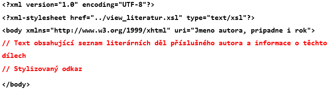
  </a><br/>

</div>


#### Poznatky

##### 

Struktura je konzistentní pro všechny kontrolované soubory obsahující
bibliografické seznamy literárních děl příslušného autora. Hlavička je
standardní u všech literárních záznamů. Pořadí elementů (až na výjimky,
viz níže) je konzistentní, pro ohraničení údajů se používají v každém
souboru identické tagy. Elementy se nepřekrývají. Pro vysázení do *HTML*
je použit XSLT style-sheet (*view_literatur.xsl*). Obsahová část je
uvozena elementem *$<$body$>$*. Řetězec URI kopíruje strukturu názvu
souboru. Je tvořen dvojicí jméno autora a rok publikování díla.\
\
Obsah těla XML souboru se vždy liší a mezi jednotlivými soubory
nepřevládá žádná konvence. Vždy je zde uvedeno celé jméno autora
(popřípadě i spoluautorů) a název díla. Je-li k dispozici i archiv
umístění díla, je zde taktéž uveden. Všechny textové popisy díla
obsahují i rok vydání díla a některé i místo vydání. Tělo také může
obsahovat informaci o čísle stránek či jednotlivých svazků. Jelikož se
jedná o textový řetězec a jeho struktura není pro všechny soubory
stejná, je do něj možné doplnit prakticky jakoukoliv informaci o dílu.
Neobsahuje dlouhé úseky souvislého textu, gramatika nebyla detailně
kontrolována.

-   Seznam děl je nutné zachovat. Jedná se o textové řetězce není nutné
    provádět specifickou transformaci. Seznam děl **se** v souborech
    **vyskytuje vždy**, **zápis** textu je **konzistentní**.

-   Informace o díle jsou ve zdrojových souborech odřádkovány, nejsou
    však vždy uvozeny tagem (*$<$br/$>$*). **Zápis konzistentní**,
    **výskyt nepravidelný**.

-   Veškerý obsah informací se vyskytuje ve zdrojových souborech jako
    prostý text v jednom elementu. Je vždy uvozen tagem *$<$body$>$*.
    **Zápis konzistentní**, **výskyt pravidelný**.

-   Soubory mohou obsahovat vložené odkazy. Například soubor „Lit\_
    Vignau-Wilberg_1992.xml" obsahuje dokonce stylizovaný hypertextový
    odkaz. Odkaz vede na dané literární dílo na Google Books
    [(URL)](https://books.google.com/). Je nepravděpodobné, že se jedná
    o jediné dílo, pro které existuje jeho online verze. Jelikož se
    jedná o manuálně vytvořené a naplněné zdrojové soubory jedním
    autorem, je možné, že se rozhodl jen do nějakých vložit odkaz na
    e-verzi díla. **Zápis je nekonzistentní**. Textový obsah
    s informacemi o dílech je **pravidelný**, avšak odkaz na online
    verzi díla je **nepravidelný**.

-   Doprovodné webové odkazy do digitálních archivů, či na digitální
    verzi publikace je **vhodné ponechat**, avšak v jednotné podobě a
    vždy na stejné pozici v textu (např. za textem knižního záznamu).
    **Nutno** transformovat pro zajištění konzistence. **Výskyt
    nepravidelný**.

-   Na soubory se seznamy citujících děl je možné se přesměrovat pouze
    z detailu přepisovaného záznamu v kolekci ***Regesten***. Přehled
    všech souborů s literaturou není k dispozici v ucelené podobě.
    **Vazby je nutné zachovat**. Vytvoření přehledu není nezbytně nutné.

### Namen

#### Přehled

##### 

Zahrnuje XML soubory s informacemi o jedné konkrétní historické osobě.
U osob je evidováno jméno, případně titul. U „západních" jmen je použita
interpretace v pořadí „příjmení", „jméno". Následuje přirozený zápis
celého jména včetně přízvisek a titulů. Dále zde mohou být uvedena místa
a data narození, případně úmrtí a další jména, pod kterými je možné
osobu identifikovat. V některých záznamech je možné najít i jména
blízkých horizontálních příbuzných (manžel/manželka) v doprovodu dalších
detailů, tak i výpis povolání. Dále jsou zde explicitně uvedeny
reference na všechny textové záznamy, ve kterých osoba figuruje.
Odkazováno je do kolekce ***Regesten***. Jsou-li pro osobu evidována
tištěná díla (*Gedruckte Werke*), následuje jejich výčet. Pro (budoucí)
vyhledávání byly v rámci archivu pro každou osobu stanoveny indexy,
které se vytvářejí systematicky postupným přidáváním písmen obsažených
v příjmení/titulu osoby (limitace maximálním počtem - šest).

#### Struktura XML souboru

<div align="center">
  <a href="https://gitlab.com/josef.bozdech2/tgi_sp/-/blob/develop-2023">
    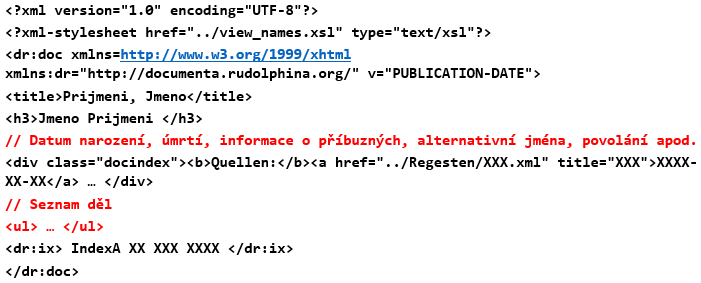
  </a><br/>

</div>

#### Poznatky

##### 

Pořadí elementů (až na výjimky, viz níže) je konzistentní, pro
ohraničení údajů se používají v každém souboru identické tagy. Elementy
se nepřekrývají. Hlavička dokumentu je shodná u všech zdrojů. Uchovává
se informace o poslední verzi (datum). Zápis referencí a indexů pro
vyhledávání je konzistentní. Rozdíly je možné pozorovat u detailu dané
osoby. Datum a místo narození, respektive úmrtí, nejsou ve všech
záznamech dostupná. Stejný případ platí i u jmen příbuzných, povolání a
seznamu tištěných děl -- jedná se o dodatečné údaje, které ani nemusí
být kompletní (ať už např. z hlediska data, či lokace). Při zpracování
je nutné brát v potaz možnost výskytu všech dodatečných údajů. Soubory
neobsahují dlouhé úseky souvislého textu, gramatika nebyla detailně
kontrolována.

-   Životní data osoby a případně dodatečné identifikátory ($*$ - datum
    narození; - datum úmrtí; $\infty$ - datum, místo sňatku a jméno
    choti) nejsou v souboru opatřeny tagy (tím pádem ani odřádkovány).
    Jsou chápány jako jeden dílčí řetězec. **Zápis** se jeví být
    **konzistentní**, **výskyt nepravidelný**.

-   K zobrazení copyrightu dochází pomocí style-sheetu. Výpis informace
    o verzi funguje stejně jako u kolekce ***Archives***.

-   Informace (respektive řetězec) o příbuzných dotyčné osoby je vždy
    odřádkována ($<$br/$>$). **Zápis konzistentní**, **výskyt
    nepravidelný**.

-   U výpisu povolání nastala situace, že v některých případech nejsou
    odřádkována. Nebylo prokázáno, že by se tento jev týkal pouze
    neúplných záznamů (tj. bez dat zahájení/zanechání zaměstnání).
    V dalších případech jsou uvozena tagem $<$br/$>$ značící odřádkování
    -- **zápis je nekonzistentní**. **Výskyt nepravidelný**.

-   Seznam děl se vkládá mezi reference do záznamů a vyhledávací indexy.
    Uvozeno slovním spojením *Gedruckte Werke*. Jedná se o neseřazený
    seznam prostých textů. Ukázka:\
    ***Gedruckte Werke:\
    $<$ul$>$\
    Julius Alessandrini a Neustain, Antargenterica pro Galeno\
    (Venetiis 1552). \[ÖNB BE.9.N.65.(3).\]\
    $</$ul$>$***\
    **Zápis konzistentní**, **výskyt nepravidelný**.

-   V osobě jsou uvedeny hypertextové odkazy na všechny přepisy, ve
    kterých je zmiňována.

### Regesten

#### Přehled

##### 

Obsahuje XML soubory s jednotlivými přepisy zaznamenaných textů. Název
souboru je sestaven z prefixu „A" (pro archiv), data (z něhož původní
text pochází) a z pěticiferného číselného indexu. Název souboru je
shodný s jeho *URI*. Z jednoho dne může pocházet více záznamů. K rozboru
byla vybrána pouze podmnožina (Archive - Praha - Archiv Pražského
hradu - Dvorská komora). Po standardní hlavičce následuje název záznamu,
případně i datum a místo, kde byl pořízen. V jistých případech je zde
možné najít *metadata* uvozující v textu se vyskytující osoby. Pak jsou
uvedeny reference na „zainteresované" osoby, kterých se text týká
(konkrétní tvar referovaného jména v textu lze odečíst z funkce
$onmouseover= "highlightWords()"$). Následuje přepis původního textu.
V textu může být umístěn neseřazený seznam položek. Pod textovým
segmentem jsou umístěny *metadata* o archivu, z něhož zápis pochází a
následují reference na jednotlivé hierarchické stupně archivu. Výpis
archivního zanoření je zakončen číslem záznamu/spisu. Může následovat
informace o dřívější katalogizaci, v podobě zdrojového archivu a čísla
svazku. Autor v některých záznamech uvádí i seznam pozdějších děl,
citující zde přepisovaný originál.

#### Struktura XML souboru

<div align="center">
  <a href="https://gitlab.com/josef.bozdech2/tgi_sp/-/blob/develop-2023">
    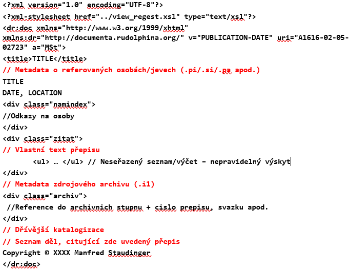
  </a><br/>

</div>

#### Poznatky

##### 

Pořadí elementů v souborech (v rámci podmnožiny) je konzistentní. Údaje
jsou ohraničeny totožnými tagy. Elementy se nepřekrývají. Hlavička
dokumentu je shodná u všech zdrojů. Pro vysázení do *HTML* je použit
identický XSLT (*view_regest.xsl*) v doprovodu *CSS*. Všechny zkoumané
soubory v sobě zahrnovaly referenční seznam osob, překlad vlastní
textové části a hierarchii archivu (včetně zanoření). Rozdíly bylo možné
pozorovat především v překládaných textech ze stylizačních důvodů.
Soubory se také lišily rozdílným množstvím *metadat* a přítomností
informací o dřívější katalogizaci a výskytu v pozdějších dílech. Při
zpracování je nutné brát v potaz možnost výskytu všech výše uvedených
údajů.

-   Vysázení textu přepisu se řídí dle style-sheetu *view_regest*. Ten
    se může odkázat na příslušné kaskádové styly. V textu se vyjma
    přepisovaných dobových textů nacházejí i **vysvětlivky** (např.:
    *fol. v*, *fol. r*, *Betreff:*, *Datum:*, *Ablage:*, *Resolution:*,
    *Vermerk:*, *Gezeichnet:* a podobně). Zvýraznění se uskutečňuje opět
    skrze style-sheet. Společným znakem je umístění v hranatých
    závorkách.

-   V textu přepisu se mohou nacházet tagy $<$del$>$, respektive
    $<$/del$>$. Ve vizualizaci fungují tím způsobem, že takto ohraničený
    text je vypsán, ale zároveň i přeškrtnut. Můžeme se jen domnívat,
    jaký byl význam tohoto jevu (např. zneplatnění v kombinaci se
    zachováním původní informace). Při transformaci je nutné tento
    výskyt ošetřit, aby nedošlo k chybnému zpracování a tím i ke ztrátě
    informací.

-   Jedná se o dlouhé souvislé texty. Po gramatické stránce jsou
    evidovány chybějící písmena v přepisovaných slovech. Autor
    zdůrazňuje tuto skutečnost uvedením hranatých závorek. Ty mohou, ale
    nemusí, domnělé znaky obsahovat. Autentičnost záznamu však může být
    narušena. Dalším častým jevem je archaický zápis zaměňující
    samohlásku „u" se souhláskou „v". Tento jev však není plošný.
    Zaznamenány byly i překlepy, které pravděpodobně byly způsobeny
    manuálním přepisem. **Texty je vhodné v této podobě zachovat**,
    **včetně stylisticky odlišných značek**. Korektura by měla být
    provedena dostatečně kvalifikovanými subjekty.

-   Součástí zdrojového souboru, podobně jako u kolekce ***Archive***,
    je informace o verzi a copyrightu. Verzování funguje stejně jako
    u kolekce ***Archive***, odkaz zobrazí **návrh citace přepisu**.
    Copyright je zde uveden přímo v XML souboru jako textový řetězec.

-   Metadata (data o datech) o odpovídajícím archivu byla přítomna ve
    všech zdrojových souborech, *metadata* týkající se jmen vždy
    korelovala s referovaným seznamem. Metadata vždy byla uvozena znakem
    pro instrukci zpracování jako např.: $.pi$ (uvozuje osoby), $.si$
    (uvozuje literaturu), $.pa$, $.i1$ (uvozuje fyzické umístění
    původního textu), $.*$, $.cs$. Takto uvedené řetězce nejsou ve
    webovém pohledu vysázeny. V případě jmen osob, či názvů archivů se
    navíc jedná o duplicitní (již zavedenou) informaci. Výskyt je
    nepravidelný, *metadata* je **vhodné zachovat**, **na výstupu
    nezobrazovat**.

-   Informace o katalogizaci (zdrojový archiv a číslo svazku) je uvozena
    instrukcí $.i1$. Na výstupu se nezobrazuje, identická informace je
    uvedena za hierarchií archivů a v záhlaví přepisu. **Vhodné
    zachovat**, *na výstupu nezobrazovat*.

-   Je-li uvedeno, že přepisovaný záznam byl doložen v jiných dílech
    (uvozeno spojením: *„Zitiert in"*, *„Zitiert nach"*, případně
    *„Literatur"*), je vypsán seznam citující literatury. Zajímavým
    poznatkem je, že pod jménem autora a rokem publikace je skryt odkaz
    do kolekce ***Indices*** na příslušný seznam bibliografie. Element
    představující odkaz do kolekce zde však není explicitně uveden (na
    rozdíl například od referencí na osoby). Tato závislost nesmí být
    při transformaci opomenuta a funkcionalita musí být zachována.
    K přiřazení odkazu dochází na **pozadí** -- opět skrze XSL sheet
    ***view_regest***. V XML se jedná o běžný textový řetězec. **Výskyt
    jevu je nepravidelný**, **nutné doplnit a zohlednit**.

-   Přepis si drží informace (odkazy) o osobách, které zmiňuje.

## Výstup analýzy

##### 

Jelikož při této analýze došlo ke zkoumání jen omezeného množství
souborů, lze usuzovat, že kvůli tomu, že soubory vznikaly manuálně, tak
s velkou pravděpodobností existuje množství nesrovnalostí, chyb a
odchylek, které se mohou při práci s více soubory objevit.\
\
Během analýzy se uskutečnilo i porovnání zobrazení dokumentů v několika
webových prohlížečích (*Chrome*, *Firefox*, *Safari* a *Edge*) při
aktuálních verzích. Během tohoto zkoumání byla zjištěna nesrovnalost se
zobrazováním verze souboru v kolekci ***Regesten***. Celkové chování
v prohlížeči *Mozilla* bylo zásadně odlišné od ostatních prohlížečů --
docházelo například k přesměrování na novou stránku obsahující pouze
podseznam namísto hierarchického rozbalovacího (*drop-down*) seznamu
(v rámci struktury archivu). Domníváme se, že data uložená
v samostatných XML souborech a stylování pomocí XSLT neodpovídají
kvalitě a standardu moderních webů. Absence souborového systému (typu
databáze) zhoršuje přehlednost a přidávání nových stránek znamená
vytváření nových XML souborů a propojení skrze kolekce.

# Databáze autorit a propojení

V rámci programu Open Access společnosti Getty poskytuje společnost
veřejný přístup k většině dat z jejích sbírek prostřednictvím rozhraní
API. Tato rozhraní API jsou stejná, která používají v pozadí jejich
webu, Getty Guide a dalších klíčových aplikací. ULAN API poskytuje
přístup k datům v databázi ULAN, včetně biografických informací, dat
narození a úmrtí, pohlaví a dalších relevantních informací. Z hlediska
výkonu je ULAN API spolehlivé a rychlé. Dokáže zpracovávat více
požadavků paralelně a jeho doby odezvy jsou obecně pod několik sekund.
Rozhraní API navíc poskytuje podrobnou dokumentaci, výukové programy a
ukázkový kód, které vývojářům pomohou rychle začít.Celkově je Getty ULAN
API dobře navržené, spolehlivé a snadno použitelné webové rozhraní API,
které poskytuje bezpečný přístup k databázi ULAN.

Getty API je ve skutečnosti znalostní graf, který používá standardy
Linked Data JSON-LD a RDF. Tímto se však, jelikož chceme API pouze
používat, nemusíme se vůbec zabývat -- stačí nám si je pouze představit
jako REST API, která poskytují trochu neobvyklý JSON.

Getty ULAN API lze připojit registrací klíče API. Po registraci klíče
API lze získat přístup k API pomocí následujících kroků:

1.  Vytvoření adresy URL požadavku s pověřeními API.

2.  Vytvoření požadavku GET nebo POST s URL.

3.  Odpověď API vrací ve formátech XML nebo JSON, v závislosti na
    provedeném požadavku. V našem případě se logicky jedná o odpověď v
    JSON formátu.

Co se týče důvěryhodnosti dat, při používání Getty Ulan API je důležité
zajistit, aby data, která se načítají, byla přesná a spolehlivá. Pro
zajištění důvěryhodnosti se doporučuje porovnat data získaná z API s
jinými zdroji, jako jsou existující databáze a katalogy. Kromě toho je
důležité zkontrolovat platnost údajů, jako je přesnost dat, názvy děl a
autoři. Nakonec se doporučuje zkontrolovat související informace o
autorských právech a licencích pro obrázky získané z API.

Chceme-li připojit Getty ULAN k jiným autoritám, musíme použít službu,
jako je OCLC Linked Data Services. Tato služba poskytuje přístup k řadě
autoritativních databází, včetně Getty ULAN, a umožňuje propojení dat a
integraci dat napříč více zdroji. Chceme-li používat tuto službu, musíme
si zaregistrovat účet a nastavit profil Linked Data Service. Jakmile je
profil nastaven, lze se ověřit pomocí rozhraní Getty ULAN API a poté se
připojit k dalším autoritám pomocí rozhraní API Linked Data Service.
Další informace o nastavení profilu Linked Data Service a připojení k
jiným úřadům lze nalézt v dokumentaci OCLC Linked Data Services.

Přidávání dalších autorit by bylo z důvodu přehlednosti a jednoduchosti
řešeno manuálně. V databázi se pro aktuálnost dat pak jako vhodné řešení
nabízí vytvoření například týdenního (časový horizont se samozřejmě může
lišit na různých závislostech) úkolu na provolání všech API a uložení
výsledků.

# Návrh řešení

Během týmové debaty vznikla dvě řešení.

## Zachování stávajících struktur

Pouhé přestylování současného Inventaria Rudolphina a přidání search do
webu. Search ale pravděpodobně bude značně pomalejší, neboť čtení
souborů a vyhledávání v nich je pomalejší než v DB. Počet souborů je již
nyní odhadován na 25 000 souborů.

Dále by bylo potřeba doplnit funkci vyhledávání autorit, což znamená
přidat další stránku, která by pokrývala možnosti přidávání a odebírání
autorit.

Tato možnost je značně složitá a debatou mezi týmy jsme došli k závěru,
že tento návrh není vhodný. Důvodem je to, že současná struktura webu je
značně zastaralá, nesrozumitelná a uživatelsky nepříliš přívětivá. Data
uložená v samostatných XML souborech a stylovaná pomocí XSLT stylů
neodpovídají kvalitě moderních webů. Absence databáze zhoršuje
přehlednost, přidávání nových stránek tak znamená vytváření nových XML
souborů.

## Vytvoření nového systému

Modernější možností je navržení třívsrtvé standardní architektury
frontend-backend-databáze.

Toto řešení se dá dále rozvíjet podle schopností vývojářů a rozpočtu
zadavatele. Vzhledem k nulovému rozpočtu mohu dodat obrázek z malování
v rastrovém formátu.

## UI návrh

Návrh byl vytvořen v aplikaci Figma. Pro využití reálných Semantic
komponent byl použit plugin SemanticUI do Figmy, díky kterému se daly
využít již existující komponenty v pixel perfect formátu. To znamená, že
design daných komponent ve Figmě odpovídá přesnému designu reálných
komponent od SemanticUI, jako když se naimplementují. Komponenty od
SemanticUI však byly ve Figmě špatně nakresleny, což komplikovalo práci
s návrhem a jejich použití v obrazovkách. Bylo tedy třeba vytvořit
komponenty od ruky podle jejich reálného vzhledu, tj. ve Figmě ručně
nakreslit komponenty podle reálných komponent, které se k implementaci
použili. Z tohoto důvodu navržený *wireframe* (na rozdíl od pixel
perfect se jedná bezbarvý formát sloužící pouze pro náhled návrhu)
neodpovídá naimplementovanému vzhledu na 100%.

Byly vytvořeny tři hlavní obrazovky, které jsme následně implementovaly
v prototypu. Jedná se o obrazovky *Dokumente* záložky a jeho obsah, tzn.
větvení jednotlivých archivů. Poté detail dokumentu a nově
implementovaný search.

### Dokumente

V návrhu bylo apelováno na zjednodušení a minimalismus. Zároveň bylo
cílem využít prázdné místo na stránkách, které se dalo jednoduše zaplnit
dalšími funkcemi a následně tak ulehčit práci z hlediska UX.

Menu, které se na původním webu objevovalo pouze na jedné stránce
v oblasti postranního panelu, bylo posunuto do menu na horní část
obrazovky, která bude konstantně viditelná. Do horní části byla také
přidána položka pro vyhledávání.

Snahou bylo zjednodušit také vyhledávání stromem mezi jednotlivými
archivy. SemanticUI však nemá zcela ideální komponenty pro návrh
takovéto skupiny. Cílem bylo vyhnout se *dropdownům* v rámci menu, které
nejsou zcela uživatelsky přívětivé pro velké zanoření, což je bohužel
tento případ. Proto byla použita komponenta *Nested Accordions*, která
umožní rozbalení stromu velmi podobně, jako tomu bylo doposud.

<div align="center">
  <a href="https://gitlab.com/josef.bozdech2/tgi_sp/-/blob/develop-2023">
    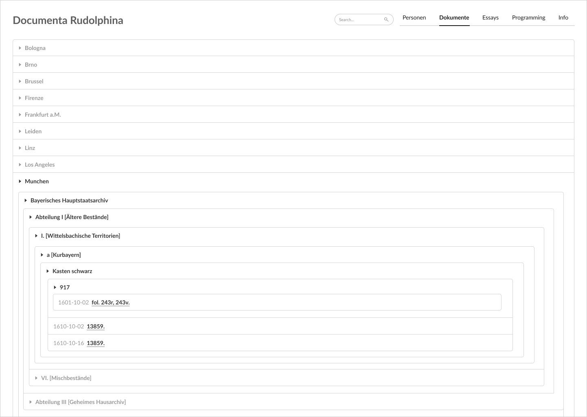
  </a><br/>

</div>


### Detail dokumentu

Pro stránku s detailem dokumentu bylo cílem využít lépe prázdné místo a
z hlediska UX opět upravit vzhled dle pravidel. Toto se týkalo např.
drobečkové navigaci, která by měla být vždy v horní části obrazovky pro
lepší navigaci. Tagy, neboli jednotlivé *Personen* (zmínky v textu),
které se daly rozkliknout nebo zvýraznit v textu, byly přesunuty na
pravou část obrazovky. Tyto tagy budou rovnou otevřené (tzn. informace
můžeme vidět rovnou a ne až po kliknutí na jednotlivé položky) a po
jednoduchém kliknutí můžeme vidět zvýrazněné v textu tak, jak byli
uživatelé doposud zvyklí.

Je třeba zmínit, že na reálně naimplementovaný prototyp jsou použity
komponenty *Card*, které se v nakresleném návrhu nepoužili opět z toho
důvodu, že ve Figmě chyběl jejich návrh od SemanticUI pluginu. Proto
tedy tento návrh a naimplementovaný prototyp není zcela 100% identický.

<div align="center">
  <a href="https://gitlab.com/josef.bozdech2/tgi_sp/-/blob/develop-2023">
    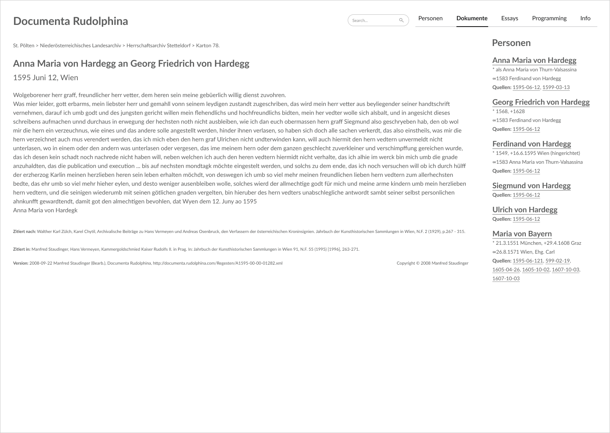
  </a><br/>

</div>


### Vyhledávání

Jako poslední byla navržena obrazovka s výsledky vyhledávání. Návrh
povoluje vyhledat jakýkoliv text. Na stránce se objeví informace
o vyhledávaném stringu a poté výsledky vyhledávání v podobě data a názvu
jednotlivého záznamu včetně drobečkově navigace, která zobrazuje cestu,
neboli kam záznam patří.

<div align="center">
  <a href="https://gitlab.com/josef.bozdech2/tgi_sp/-/blob/develop-2023">
    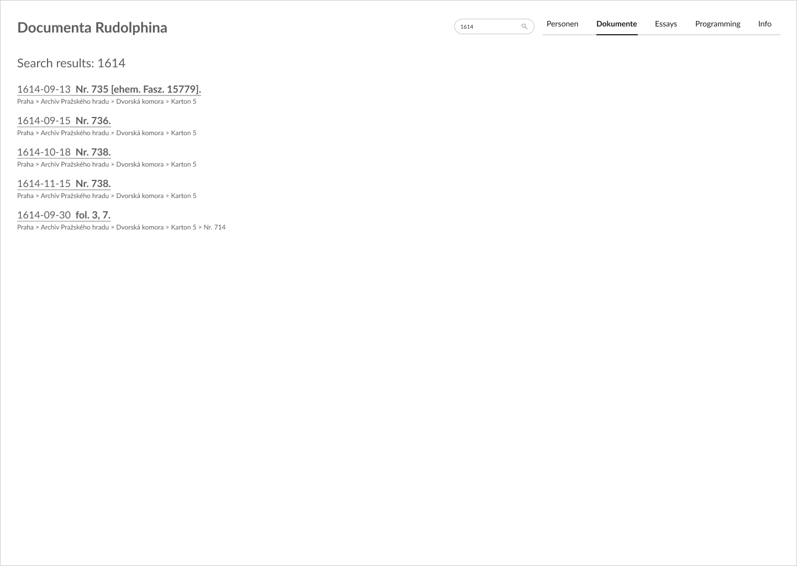
  </a><br/>

</div>

### Databáze {#subsecDB}

Data je možné uchovávat v SQL a NoSQL databázích. První možnou volbou je
Oracle databáze podporující XML soubory. Toto řešení bychom ovšem
nedoporučovali, neboť XML soubory v relačních databázích nejsou
standardem a taková implementace by byla značně náročná. XML soubory
dokonce obsahují celé HTML.

Vhodnějším řešením je transformace XML dat do JSON souborů a jejich
následné vložení do MongoDB. MongoDB dovoluje vyhledávat fulltextově a
umožňuje i složitější dotazy. Jeví se jako řešením přímo na míru
vyhledávacímu úkolu.

Díky tagům by bylo možné i optimalizované vyhledávání.

### Server

V serverové části jsou opět 2 možnosti. Spring boot je standardem
v tvorbě serverů a toto řešení je solidní. Learning curve u Springu je
nicméně velice příkrá a pro programátory-začátečníky není nejvhodnější.

Druhou variantou je NodeJS, který je lehký na naučení, má silnou
integraci s MongoDB a díky tomu, že se píše JavaScriptem, je vhodný pro
programátory, kteří se orientují primárně na frontend.

### Frontend

I v této části je výběr ze dvou možností. Jednodušším řešením je tzv.
server-side rendering. Tím je eliminována nutnost naprogramovat
samostatný frontend.

Druhou možností je použití některého z frameworků pro tvorbu webových
stránek. Z nejpoužívanějších se nabízí React, Vue.js, nebo Angular.

Ze zadání vyplývá potřeba použít knihovnu SemanticUI, aby byl zachován
jednotný styl stránek Rudolphina. Všechny z těchto 4 možností podporují
SemanticUI, nicméně Angular nemá tuto funkcionalitu kompletní.
V požadavcích byla možnost využít knihovnu FomanticUI. Po prozkoumání
bylo zjištěno, že se jedná o komunitou podporovanou verzi SemanticUI, do
které jsou přidány některé komponenty navíc, další funkcionalitu ale
FomanticUI neupravuje. V další práci je proto zmiňována pouze knihovna
SemanticUI. Vytvořena byla tedy miniaturní aplikace napsaná v Reactu
s pomocí SemanticUI knihovny obsahující přepracovaný seznam děl, možnost
prohlížení jednotlivých děl a možnost vyhledávat fulltextově jednotlivá
díla. Vzniklo několik návrhů na vzhled jednotlivých obrazovek, obzvláště
pak na seznam děl, vybrán byl rozklikávací akordeon podobný tomu na
původním webu. Search je implementován tak, že je odeslán dotaz na
backend, který následně vrátí výsledky vyhledávání z databáze, frontend
je následně zobrazí a uživatel si může vybrat, zdali chce na nějaký
výsledek přejít.

<div align="center">
  <a href="https://gitlab.com/josef.bozdech2/tgi_sp/-/blob/develop-2023">
    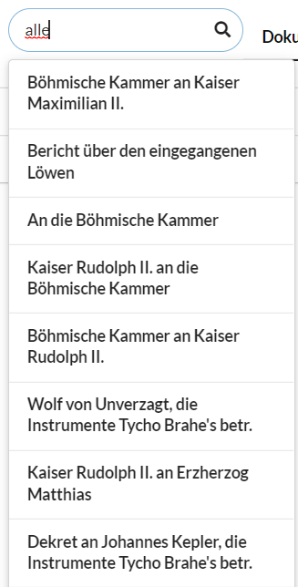
  </a><br/>

</div>

<div align="center">
  <a href="https://gitlab.com/josef.bozdech2/tgi_sp/-/blob/develop-2023">
    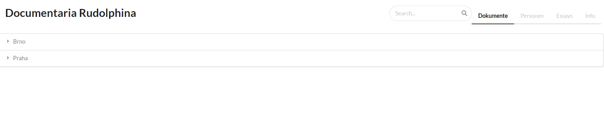
  </a><br/>

</div>

<div align="center">
  <a href="https://gitlab.com/josef.bozdech2/tgi_sp/-/blob/develop-2023">
    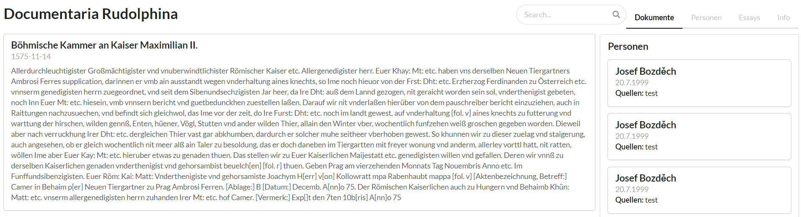
  </a><br/>

</div>

Největší problém při vývoji této aplikace nastal při práci s knihovnou
SemanticUI. Její implementace je v porovnání například s MaterialUI
značně nekvalitní, pro návrh vzhledu webu nejsou k nalezení všechny
komponenty v nástroji Figma, což zhoršuje proces návrhu, dokonce ani
stylování jednotlivých komponent není dostatečně podporováno. Ostatní
knihovny podporují úpravu vzhledu svých komponent styly, bootstrapem,
nebo pomocí parametrů předávaných komponentám. Primárním příkladem je
prvek Card, se kterým byla vytvořena komponenta pro zobrazování
jednotlivých dokumentů. Chtěli jsme vzhled stránky upravit tak, aby bylo
možné do Card přidat např. additional info z dokumentů. Zatímco
v MaterialUI je toto práce na pár minut, u SemanticUI jsem s tím bojoval
více než hodinu a nepodařilo se mi to zprovoznit.

Navrhuji při potenciální tvorbě webu využít jinou UI knihovnu.

# Transformace XML do JSON

Na základě analýz a návrhů, popsaných v předchozích kapitolách
(5.3.4, 3) jsme se rozhodli pro přístup transformace `XML`
souborů do formátu `JSON` a využití `MongoDB`.\
Ke kompletnímu nahrazení původních `XML` byly navrženy tři `JSON`
kolekce. První z nich, **Person**, reprezentuje osoby (pův. Personen) a
druhá pak samotné přepisy děl (pův. Regesten). Jelikož se nemusí nutně
jednat pouze o přepisy knih, ale celkově jakýkoliv spisů či článků,
dostala tato kolekce název **Artwork**.\
Poslední kolekce, která obsahuje pouze jeden záznam je pro udržení
stromové struktury archivů a proto nese název ArchiveLinks.

## Person

Podíváme-li se na původní `XML` soubor (viz obr.
6.1) je zcela patrné, že důležitou informací je
pro nás jméno osoby (křestní i příjmení), přezdívka pod kterou lze osobu
v dílech dohledat a informace o dílech.\
Dále jsou užitečné informace jako data a místa narození či úmrtí, a
další zajímavosti, které z XML lze vyčíst. Tyto informace nejsou ovšem
zahrnuty u každé osoby. Budeme je považovat za volitelné, doplňující
info, nikoliv však informace bez kterých bychom nemohli fungovat.\

<div align="center">
  <a href="https://gitlab.com/josef.bozdech2/tgi_sp/-/blob/develop-2023">
    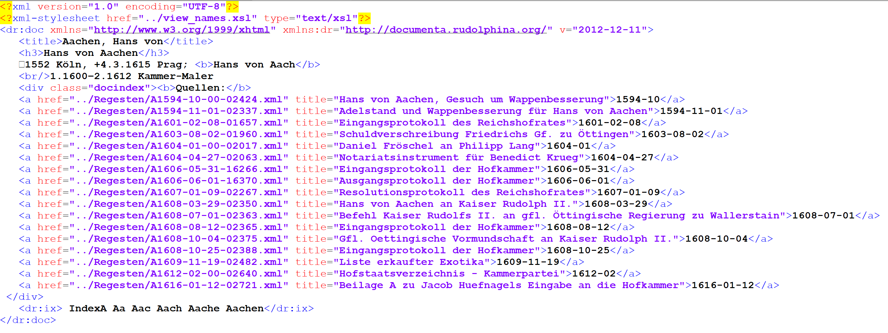
  </a><br/>

</div>

Tyto informace jsou dostačující pro uchování původních funkcionalit.\
Návrh, jak by mohl být soubor z obrázku
6.1 přetransformován lze vidět na obr.
6.2, kdy `full_name` je povinný atribut, který
dále rozdělíme na `first_name` a `last_name`. V původním XML textu
celého jména poslouží jako oddělovač jména a příjmení čárka (pokud se
nevyskytuje, považujeme text pouze za příjmení). Jelikož může nastat
případ, kdy celé jméno je např. *Karel IV*, bude považováno za příjmení
a jméno bude volitelný atribut s možností `NULL` hodnoty.\
Zmíněné doplňující volitelné info, jako jsou data narození a úmrtí plus
další zmínky o datech a městech (které v původním textu nejsou uvozeny
žádným speciálním tagem), uložíme jako prostý text do atributu
`addditional_info`.

<div align="center">
  <a href="https://gitlab.com/josef.bozdech2/tgi_sp/-/blob/develop-2023">
    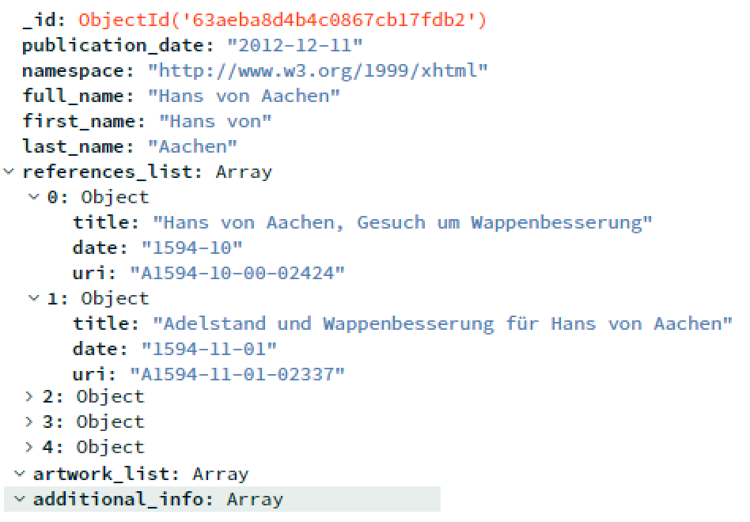
  </a><br/>

</div>


## Artwork

Stejně jako u osob i u díla se podíváme na původní `XML` soubor (viz
obr. 6.3).

<div align="center">
  <a href="https://gitlab.com/josef.bozdech2/tgi_sp/-/blob/develop-2023">
    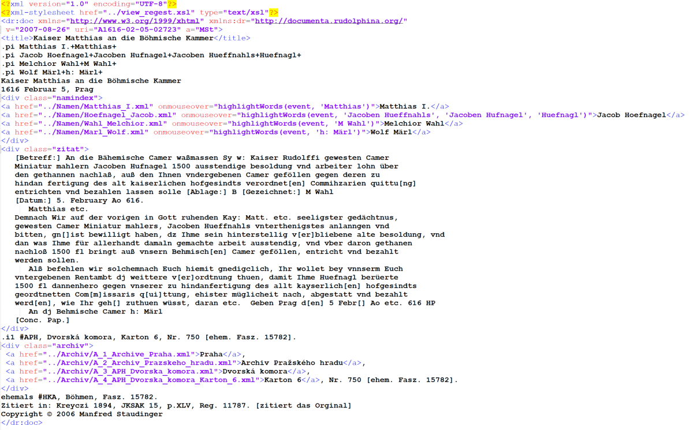
  </a><br/>

</div>


Nejdůležitější z této části je samozřejmě název a samotný text díla.
Tyto informace budeme držet v povinných atributech `title` a `text`.
Jelikož text může obsahovat další značky (př: \[Betreff:\], \[Datum:\])
se kterými se dále na frontendu může pracovat, jednoduše uložíme celý
text z $<$div class=\"zitat\"$>$ do našeho atributu text. Význam značek
nelze z kontextu přesně vyčíst, můžou připomínat poznámky autora,
překladatelské poznámky, ale některé by mohli mít i hlubší význam, který
nám ovšem není znám. V původních archivech se s těmito značkami nějak
nepracuje a v původním webu jsou normálně zobrazeny jako součást textu
spisů - z tohoto důvodu jsme se rozhodli značky neukládat jako další
atribut, ačkoliv se to může zdát užitečné a v budoucnu by se možná daly
využít. Jejich rozparsování by ale nebyl problém, pokud by se ukázalo,
že jsou potřeba pro další práci na frontendu.\
Název se v původních souborech nachází mezi tagy $<$title$>$ a
$<$/title$>$, tento obsah si pouze uložíme do stejnojmenného atributu
title.\
Kromě názvu díla, a data sepsání/publikace je dobré si držet informaci
skrze kterou se snadno dostaneme z osoby na dílo a obráceně. K tomu
poslouží `uri`, což bude jakýsi jednoznačný identifikátor. Další
hodnotu, kterou z původních souborů chceme ponechat jsou archivy (text
neohraničený tagem, ale začínající značkou *.i1* ) - ty budeme uchovávat
ve stejnojmenném atributu `archives` jako pole objektů.\
Poslední věc, která se jeví jako vhodná k zachování z původního XML
souboru jsou jména, která opět nejsou ohraničena žádným tagem, ale jsou
uvozena textem *.pi*. Tyto jména budeme uchovávat jako pole jmen
v atributu `names`.

<div align="center">
  <a href="https://gitlab.com/josef.bozdech2/tgi_sp/-/blob/develop-2023">
    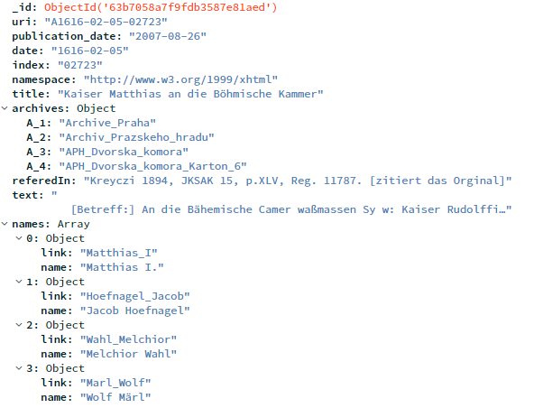
  </a><br/>

</div>


## Dotazování

S takto vytvořenými kolekcemi lze mnohem jednodušeji pracovat a vytvářet
nad nimi dotazy. Nejjednodušší dotazy jsou samozřejmě nad jednotlivými
kolekcemi.\
V případě Osob lze jednoduše získat všechny osoby dle abecedy (podle
příjmení), filtrovat dle počátečního písmene, je možné vypsat i osoby
dle narození / úmrtí - např. vypsat všechny z 16. století (ovšem pouze
u osob, jež mají o narození nějaký záznam, vzhledem k nepovinnému
atributu).\
Pro možnosti verzování lze využít atributu publication date, dle něj si
vyfiltrovat osoby, jak byly historicky přidávány a dělat v nich případné
úpravy.\
Obdobně pak u děl funguje jednoduché vyhledávání dle názvu, části textu
obsaženého v díle, osobách jež mají do činění s dílem,..\
Zajímavější dotazy jsou ovšem ne nad jednotlivými kolekcemi, ale jejich
propojení. Například výpis všech článků (nebo i textů článků) jedné
konkrétní osoby. To s takto navrženou a připravenou strukturou není
problém. Z osob se na články lze dotázat buď díky znalosti názvu článku
(ovšem mohla by nastat situace, kdy název může být pro více článků
stejný) nebo pak díky uri. Z obráceného pohledu - tedy z jednoho
konkrétního díla se samozřejmě lze také dotázat a vypsat informace
o osobě, jež v díle konfiguruje.

``` {.python language="Python"}
    #Query1: Osoba a vsechny jeji dila

    [
        {
            '$lookup': {
                'from': 'Artwork',
                'localField': 'references_list.uri',
                'foreignField': 'uri',
                'as': 'person_artworks'
            }
        }, {
            '$project': {
                'full_name': 1,
                'person_artworks.title': 1,
                'person_artworks.text': 1,
                'person_artworks.date': 1
            }
        }
    ]

    #Query2:  Dilo a info o~osobach, jez v~nem konfiguruji

    [
        {
            '$lookup': {
                'from': 'Person',
                'localField': 'uri',
                'foreignField': 'references_list.uri',
                'as': 'artwork_persons'
            }
        }, {
            '$project': {
                'uri': 1,
                'title': 1,
                'text': 1,
                'artwork_persons': 1
            }
        }
    ]
```
<div align="center">
  <a href="https://gitlab.com/josef.bozdech2/tgi_sp/-/blob/develop-2023">
    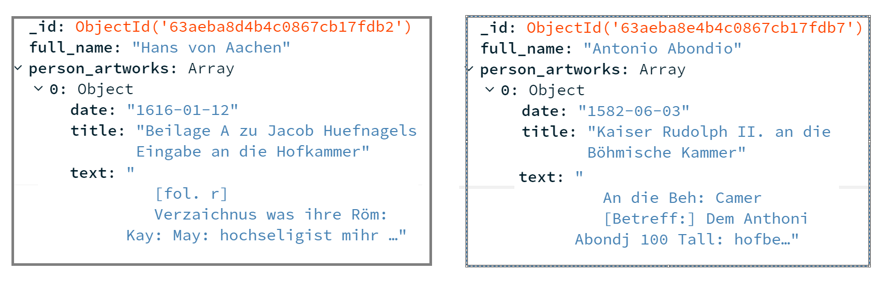
  </a><br/>

</div>

<div align="center">
  <a href="https://gitlab.com/josef.bozdech2/tgi_sp/-/blob/develop-2023">
    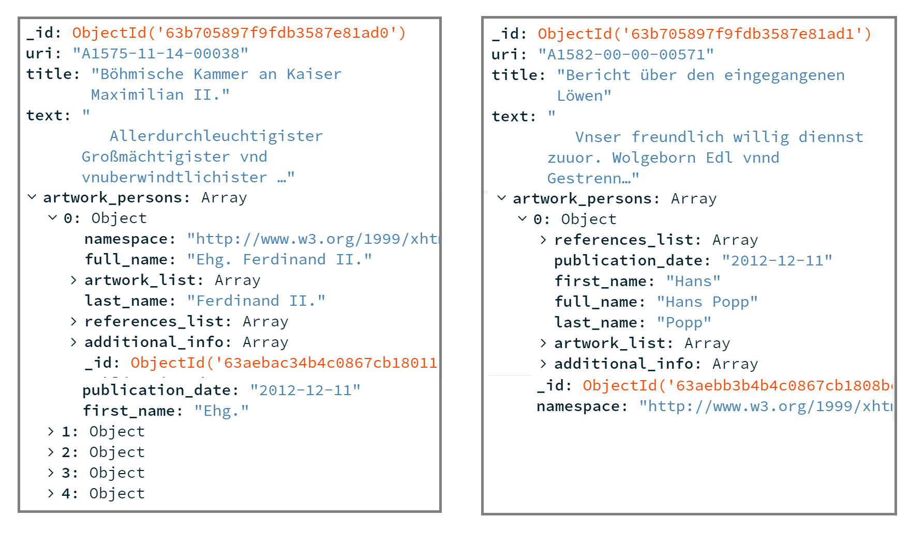
  </a><br/>

</div>


Co by nás mohlo zajímat u kolekce Archivu je pravděpodobně výpis všech
děl v konkrétním archivu. To také lze. Např. konkrétně pro výpis
z Pražského archivu, konkrétně archiv s názvem `Karton_4` by dotaz
vypadal následovně:

``` {.python language="Python"}
[caption=Dotaz pro výpis všech děl z~jednoho konkrétního archivu]

    #Query3: Vypis archivu Praha - Karton_4

    [
        {
            '$lookup': {
                'from': 'Artwork',
                'as': 'ArtworksInArchive_A4',
                'pipeline': [
                    {
                        '$match': {
                            'archives.A_4': {
                                '$regex': '.*Karton_4'
                            }
                        }
                    }, {
                        '$project': {
                            'uri': 1,
                            'title': 1,
                            'text': 1,
                            'publication_date': 1
                        }
                    }
                ]
            }
        }, {
            '$project': {
                'name': 1,
                'ArtworksInArchive_A4': 1
            }
        }
    ]
```

Výsledek tohoto dotazu lze vidět na obrázku
6.7. V prototypové databázi se nachází 4
články v archivu Karton 4 a lze je všechny přehledně vidět vypsané
v poli atributu ArtworksInArchive_A4, který jsme si tak nazvali.

<div align="center">
  <a href="https://gitlab.com/josef.bozdech2/tgi_sp/-/blob/develop-2023">
    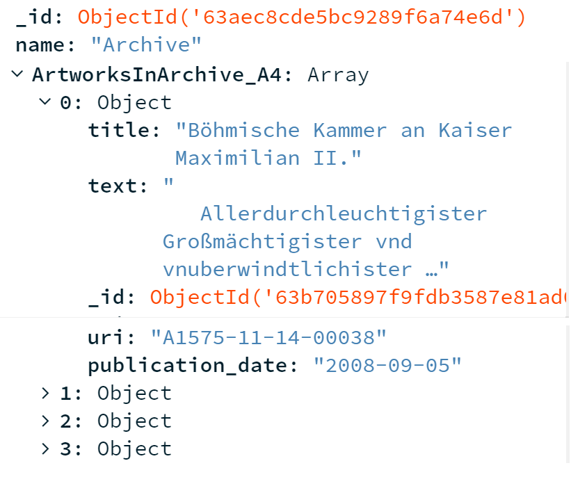
  </a><br/>

</div>

# Závěr

Výsledkem práce jsou dva návrhy na vylepšení současného webu a doplnění
funkcionalit. Ze dvou diskutovaných možností je druhá možnost, tj.
refactoring celého webu vhodnější, neboť převede zastaralý web do
modernější podoby, umožní udržitelnost a rozšiřitelnost webu dále.
